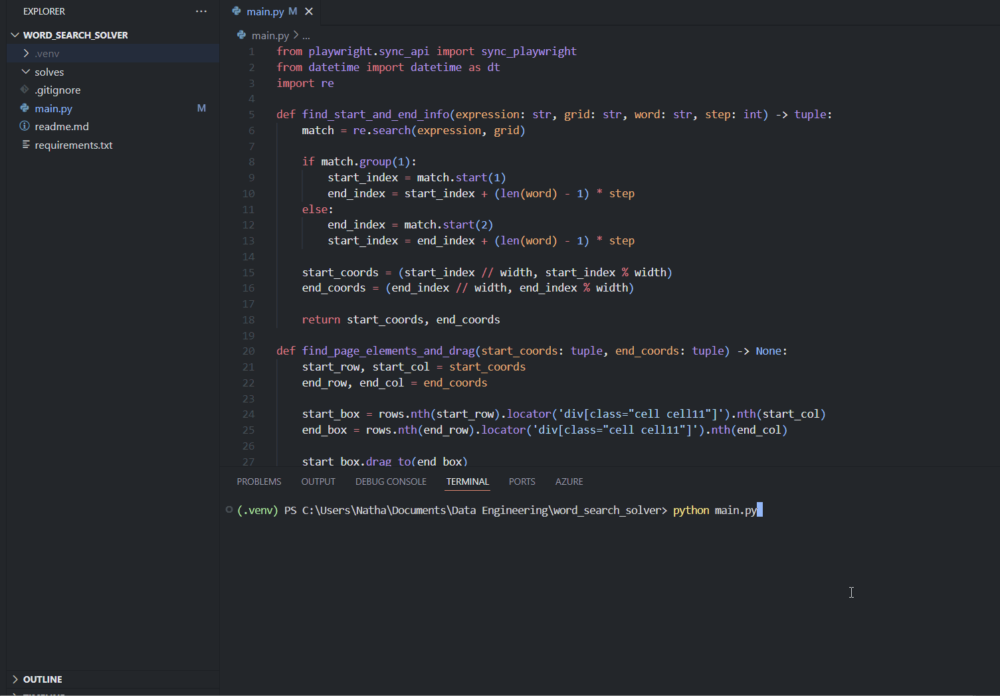

<h1>Word search solver</h1>
<a id="readme-top"></a>

Produced by Nathan Purvis - [Databasyx](https://www.databasyx.com/) co-founder | Data Engineer @ [The Information Lab](https://www.theinformationlab.co.uk/)

<h2>Contact</h2>

[GitHub](https://github.com/DataNath) | [LinkedIn](https://www.linkedin.com/in/nathan-purvis/) | [Twitter](https://x.com/DataNath) | [Alteryx Community](https://community.alteryx.com/t5/user/viewprofilepage/user-id/307299)  
Email: Nathan@databasyx.com

<h2>Overview</h2>

This is simply a fun project I wanted to have a go at recently - automating word search completion using Python. The build uses [Playwright](https://playwright.dev/python/) to conduct browser automation on [Razzle Puzzles](https://api.razzlepuzzles.com/wordsearch).



<h2>Key steps</h2>

<details>
<summary><strong style="font size 24px:";>Imports</strong></summary>

>
As always we need to bring in any packages we're using. In this case:
- `sync_playwright` is used to launch a browser and conduct our automation within
- `datetime` is used to create a timestamp for our screenshots
- `re` is used for checking regular expression matches and finding their indeces

```python
from playwright.sync_api import sync_playwright
from datetime import datetime as dt
import re
```
</details>

<details>
<summary><strong style="font size 24px;";>Create helper functions</strong></summary>

>
The script has two key functions:
- find_start_and_end_info(): Returns the grid co-ordinates that corrrespond to the start and end indeces of our word matches
- find_page_elements_and_drag(): Takes in the co-ordinates generated by the function above and interacts with the page by dragging from first to last letter (element.drag_to() is a simplification of having explicit steps for mouse down > mouse move > mouse up)

```python
def find_start_and_end_info(expression: str, grid: str, word: str, step: int) -> tuple:
    match = re.search(expression, grid)

    if match.group(1):
        start_index = match.start(1)
        end_index = start_index + (len(word) - 1) * step
    else:
        end_index = match.start(2)
        start_index = end_index + (len(word) - 1) * step

    start_coords = (start_index // width, start_index % width)
    end_coords = (end_index // width, end_index % width)

    return start_coords, end_coords

def find_page_elements_and_drag(start_coords: tuple, end_coords: tuple) -> None:
    start_row, start_col = start_coords
    end_row, end_col = end_coords

    start_box = rows.nth(start_row).locator('div[class="cell cell11"]').nth(start_col)
    end_box = rows.nth(end_row).locator('div[class="cell cell11"]').nth(end_col)

    start_box.drag_to(end_box)
```
</details>

<details>
<summary><strong style="font size 24px;";>Fetch word search grid & words</strong></summary>

>
We start off by navigating to the site and initiating a new medium difficulty game. Once this has loaded we loop through the relevant elements to create a list of the target words and grid rows. Grid rows are then flattened into a string.

```python
with sync_playwright() as p:
    browser = p.chromium.launch(headless=False)
    page = browser.new_page()
    page.goto("https://api.razzlepuzzles.com/wordsearch")

    new_medium_game_button = page.locator("#newGameMedium")
    new_medium_game_button.click()

...

        word_elements = page.locator("#words .word.word-en.word-1")
        word_count = word_elements.count()
        words = [word_elements.nth(i).inner_text() for i in range(word_count)]

        grid_element = page.locator("#wordsearchGrid")
        rows = grid_element.locator('div[class="row row11"]')
        row_count = rows.count()
        lines = [rows.nth(t).inner_text().replace("\n", "") for t in range(row_count)]

        grid = "".join(lines)
```
</details>

<details>
<summary><strong style="font size 24px;";>Find word positions</strong></summary>

>
The script works by dynamically creating regular expressions for each word, for each possible movement in the grid going either 'forwards' or 'backwards' in terms of how we would read it. To do this we also need to find the grid width to manage our offsets. Let's take the word BICYCLE as an example, in an 11 x 11 grid:
- Horizontal: (BICYCLE)|(ELCYCIB)
- Vertical: (B.{10}I.{10}C.{10}Y.{10}C.{10}L.{10}E)|(E.{10}L.{10}C.{10}Y.{10}C.{10}I.{10}B)
- Diagonal down & right: (B.{11}I.{11}C.{11}Y.{11}C.{11}L.{11}E)|(E.{11}L.{11}C.{11}Y.{11}C.{11}I.{11}B)
- Diagonal down & left: (B.{9}I.{9}C.{9}Y.{9}C.{9}L.{9}E)|(E.{9}L.{9}C.{9}Y.{9}C.{9}I.{9}B)

We start this process by creating a nested dictionary of each direction and their respective configs:
- Step: How far apart the letters are in a linear string
- Expression: How to construct the regular expression for this direction

```python
        dir_config = {
            "Horizontal": {
                "step": 1,
                "expression": lambda word, width: f"({word})|({word[::-1]})",
            },
            "Vertical": {
                "step": width,
                "expression": lambda word, width: "("+f".{{{width-1}}}".join(word)+")|("+f".{{{width-1}}}".join(word[::-1])+")"
            },
            "Diagonal down right": {
                "step": width + 1,
                "expression": lambda word, width: "("+f".{{{width}}}".join(word)+")|("+f".{{{width}}}".join(word[::-1])+")"
            },
            "Diagonal down left": {
                "step": width - 1,
                "expression": lambda word, width: "("+f".{{{width-2}}}".join(word)+")|("+f".{{{width-2}}}".join(word[::-1])+")"
            },
        }
```

We can now simply loop through each direction to find which expression is responsible for a match. Once a match is achieved, thanks to our dictionary, we have the step size to pass in and run both helper functions.

```python
        for word in words:
            for dir, config in dir_config.items():
                expression = config["expression"](word, width)
                match = re.search(expression, grid)
                if match:
                    direction_counts[dir] += 1
                    step = config["step"]
                    start_coords, end_coords = find_start_and_end_info(expression, grid, word, step)
                    find_page_elements_and_drag(start_coords, end_coords)
                    break
```
</details>

<details>
<summary><strong style="font size 24px;";>Print information</strong></summary>

>
For better or worse, I always like to spit some information out for the end user to see. Part of this case is showing a breakdown of words found by their direction. Doing this is simple, we can dynamically create a new dictionary from our previously-created nested dictionary. Dictionaryception!

```python
direction_counts = {k: 0 for k in dir_config}
```

This is then used in our overall messaging which looks like so:

```python
        print(f"Starting puzzle {puzzle+1}...")

...

        print("\n".join(f"{direction}: {count}" for direction, count in direction_counts.items()))

...

        print(f"Completed and screenshotted puzzle {puzzle+1} of {puzzle_n}!\n")
```
</details>

<details>
<summary><strong style="font size 24px;";>Creating screenshots</strong></summary>

>
One of the many cool things about Playwright is the ability to screenshot pages. As standard, we can take a snap of certain elements, or the whole page. However, to keep things neet and refined (just the grid and word list), we can also use the 'clip' kwarg to pass in a dynamic area. To do this we find the minimum x and y coordinate of the two elements' bounding box i.e. the top-left most point. From there we can simply define a width and heigh from this point. I added some manual adjustments just for tidiness and preference! Screenshots are then output to a `solves/` directory relative to `main.py`:

```python
        x = min(grid_area["x"], word_area["x"]) - 25
        y = min(grid_area["y"], word_area["y"]) - 100
        right = max(grid_area["x"] + grid_area["width"], word_area["x"] + word_area["width"])
        bottom = max(grid_area["y"] + grid_area["height"], word_area["y"] + word_area["height"])
        screenshot_width = right - x
        screenshot_height = bottom - y

        page.screenshot(path=f"solves/{timestamp}_puzzle{puzzle+1}.png", clip={"x": x, "y": y, "width": screenshot_width+10, "height": screenshot_height})
```
</details>

<details>
<summary><strong style="font size 24px;";>Completing multiple puzzles</strong></summary>

>
I didn't build this project to simply solve one puzzle, hence the bulk of this script being placed in a `for puzzle in range(puzzle_n):` block. To set the amount of word searches we want to complete, all we need to change is the `puzzle_n` variable defined just after our helper functions.

Whilst testing, I noticed that often a pop-up trying to point users towards the site's mobile app would appear. Alongside also needing to find and press a 'new game' button, the script therefore checks whether this is active and handles it if so. If not, we simply move to the next game:

```python
        if puzzle < puzzle_n:
            new_game_button = page.locator("#endGameContent").locator("#newGameBtn")
            new_game_button.wait_for(state="attached")
            new_game_button.click()

            meta_close_button = page.locator("#metaClose")
            if meta_close_button.is_visible() and meta_close_button.is_enabled():
                meta_close_button.click()

            if new_medium_game_button:
                new_medium_game_button.click()
```
</details>

<h2>Want to run this yourself?</h2>

Great! You can simply follow these steps:

<h3>1. Clone the repository</h3>

```shell
git clone https://github.com/DataNath/word_search_solver.git
```

<h3>2. Move into the new directory</h3>

```shell
cd word_search_solver
```

<h3>3. Create a virtual environment (optional)</h3>

```shell
python -m venv .venv
```

This step isn't strictly necessary but is good practice for isolation and keeping projects lean in terms of packages and so on.

<h3>4. Activate your virtual environment</h3>

For Windows users:

```shell
.venv\scripts\activate
```

For Mac users:

```shell
source .venv/bin/activate
```

Again, this isn't strictly necessary i.e. if you're not using a venv as outlined in the step above.

<h3>5. Install required packages</h3>

```shell
pip install -r requirements.txt
```

This will install Playwright and its transitive dependencies.

<h3>6. Install Chromium browser</h3>

```shell
playwright install chromium
```

This installs the [Chromium](https://www.chromium.org/Home/) browser that this project runs on.

<h3>7. Set your puzzle amount</h3>

Change `puzzle_n = 5` to however many word searches you want to solve.

<h3>8. Sit back and enjoy!</h3>

```shell
python main.py
```

This will run the script and you can watch it execute in front of you! If you want this to run silently i.e. without a browser popping up, just change headless to `True` here:

```python
    browser = p.chromium.launch(headless=False)
```

<h2>Feedback and/or issues</h2>

Please feel free to leave any feeback or suggestions for improvement. If you spot any issues, let me know and I'll endeavour to address them as soon as I can!

<p align="right">(<a href="#readme-top">Back to top</a>)</p>